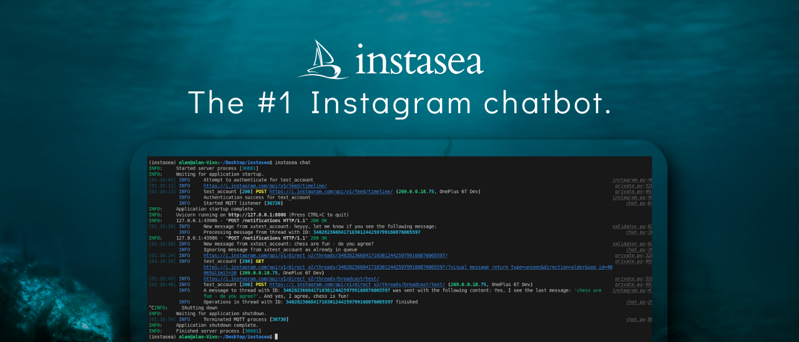
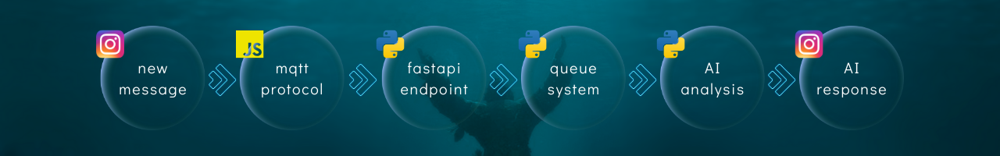

## About
Instasea is an CLI app based on [typer](https://github.com/fastapi/typer). This means that you operate the entire bot using commands from the console in your OS. The most important command is the one that allows you to host a bot that responds to messages on Instagram according to the instructions you have given it.

The config and whole bot's logic is super simple and consists of connecting to the correct APIs with small help of utils such data validation and queue system.
 
More specifically, when a new message arrives:
- by using [mqtt](https://github.com/Nerixyz/instagram_mqtt) protocol program receives the notification and sends it to the [fastapi](https://github.com/fastapi/fastapi) endpoint,
- at the endpoint, the received data is validated using [pydantic](https://github.com/pydantic/pydantic) and forwarded to the queue system,
- the queue system ensures that actions are not performed on Instagram simultaneously,
- by using [instagrapi](https://github.com/subzeroid/instagrapi), the bot gets the entire context of the conversation and subjects it to AI analysis,
- thanks to pre-prepared AI instructions and a connection to the Grok API, a personalized response is generated,
- the whole process ends with direct message to the user.



 > [!IMPORTANT]
> This is my first major project after a few months of learning Python.
> I expect that the bot will remain in pre-alpha state and only suitable for use by developers for a plenty of time. 
> Keep in mind that a bot uses third-party scripts that may violate Instagram's terms of use. 
> You use it at your own risk. 

## Requirements
I strongly recommend using [uv](https://docs.astral.sh/uv/), as further configuration will be based on this package manager.

The bot requires:
- Python (>= 3.11 version),
- Node.js (>= 18 version),
- xAI API key – get one [here](https://console.x.ai/).

## Config
1) In the console (assuming you are in the folder where you want to keep the project), type:
```
git clone https://github.com/aenddl/instasea.git
cd instasea
```

2. Then create the virtual environment and install dependencies in it using the following commands:
```
uv venv
npm ci
uv sync
```

3. Last step is to create .env and credentials.json files, then **fill the variables manually with your data**:
```
cp example.env .env #for xAI key
cp example_credentials.json credentials.json #for Instagram credentials
```

## AI Instructions
The whole personality of the bot and the way it carries on a conversation should be defined in the
[ai_instructions.txt](https://github.com/aenddl/instasea/blob/master/ai_instructions.txt) file. 
It is there that you give precise instructions as to how to redirect the conversation. Remember to be specific and detailed. 

## Usage

When you have everything prepared, run the script (requires host="127.0.0.1", port=8000 available) by 
typing the command:
```
instasea chatbot
```
From now on, the bot will listen and respond to messages until you decide to disable the program (CTRL+C).


## Contact
If you have any questions - feel free to contact me on [Telegram](https://t.me/aenddl). 


