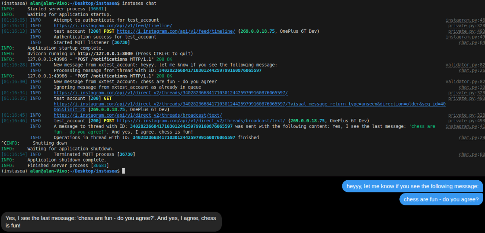

# Instasea
A real-time listening, intelligent chatbot on Instagram.

## How it works
When the bot is launched, several key processes are fired up:
- validation of Instagram account credentials (2FA supported) and creation of session if not exists,
- running JavaScript-based code listening for notifications thanks to [instagram-mqqt](https://github.com/Nerixyz/instagram_mqtt),
- firing up the queue system for subsequent processing of notifications one by one (powered by [instagrapi](https://github.com/subzeroid/instagrapi)),
- setting up REST API to receive notifications on target (based on [FastAPI](https://github.com/fastapi/fastapi))

### Then when a new message is received:
1. JS detects message 
2. Hits Python API 
3. Validates with [Pydantic](https://github.com/pydantic/pydantic) 
4. Queue
5. AI response via Grok + context.

A short lookout at the program:



> [!IMPORTANT]
> Keep in mind the fact that this is my first major project after several months of learning Python.
> Instasea is in a pre-alpha state, and only suitable for use by developers. 
> Also, the bot uses third-party scripts that may violate Instagram's terms of use. You use it your own risk.

## Requirements
- Node.js >= 18 
- Python >= 3.11 
- uv (https://docs.astral.sh/uv/) – Python package manager
- xAI API key – for the SDK

## Config

1. In the virtual environment created with the requirements as above, clone the repository:
```
git clone https://github.com/aenddl/instasea.git
cd instasea
```
2. Install dependencies:
```
npm ci
uv sync
```

3. Copy .env and credentials.json, then **fill the variables manually with your data**:
```
cp example.env .env
cp example_credentials.json credentials.json
```

## AI Instructions
The whole personality of the bot and the way it carries on a conversation should be defined in the
[ai_instructions.txt](https://github.com/aenddl/instasea/blob/master/ai_instructions.txt) file. 
It is there that you give precise instructions as to how to redirect the conversation. Remember to be specific and detailed. 

## Usage

When you have everything prepared, run the script (requires host="127.0.0.1", port=8000 available) by 
typing the command:
```
instasea chatbot
```
From now on, the bot will listen and respond to messages until you decide to disable the program (CTRL+C).

## Collaborations
The project is open to collaborations. If you want to add a new command, just add a python file in commands/ directory (+use decorator @instasea.command() above your main function). The program will register the new command by itself thanks to the registry pattern. 

## Contact
If you have any questions - feel free to contact me [here](https://t.me/synthavn). 


